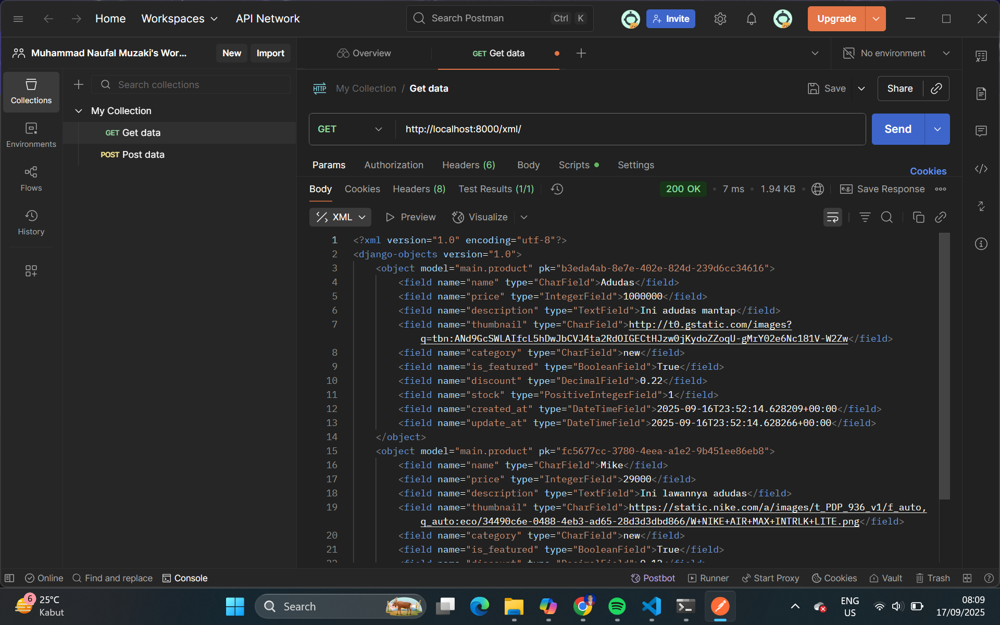
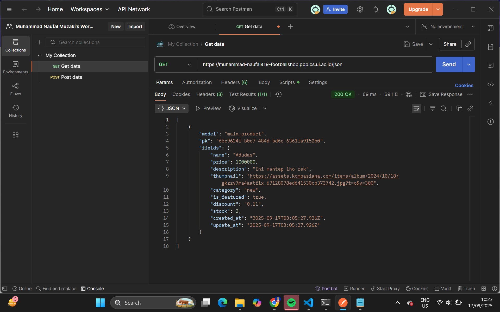

# Tugas Individu 2 PBP: Implementasi _Model-View-Template_ (MVT) pada Django

## Link Aplikasi
Aplikasi PWS saya dapat diakses pada tautan berikut:
(https://muhammad-naufal419-footballshop.pbp.cs.ui.ac.id/)

## Implementasi Checklist Tugas 2 (Step by Step)
Referensi utama saya dalam mengimplementasikannya adalah berdasarkan tutorial 0 dan 1. Selain itu, saya juga sudah mempelajari dengan baik dari materi PBP pada pertemuan-pertemuan sebelumnya dan playlist YouTube Kelas Terbuka dengan judul "Tutorial Django 1.11 LTS Bahasa Indonesia".
Berikut urutan implementasi secara berurut yang saya lakukan,
1. **Membuat proyek Django baru dan melakukan setup awal**
    Saya membuat proyek Django baru terlebih dahulu. Selanjutnya, saya melakukan setup awal proyek, seperti github, `settings.py`, `urls.py`, dan `manage.py`.
2. **Membuat Aplikasi Django**
    Saya membuat aplikasi dengan menambahkan `main` dan dilakukan _routing_ pada aplikasi tersebut dan setup awal lainnya.
3. **Membuat Model**
    Saya membuat model `Product` pada `models.py` dengan _field_ yang sudah ditentukan pada deskripsi tugas ditambah dengan beberapa field hasil kreasi saya. Setelah membuat model tersebut, saya melakukan migrasi model agar menyesuaikan perubahan pada skema basis data dengan definisi model yang sudah ada.
4. **Membuat View**
    Saya membuat fungsi pada `views.py` dan Template untuk menampilkan halaman utama.
5. **Menghubungkan URL**
    Saya menambahkan path di `urls.py` agar request diarahkan ke view yang sesuai.
6. **Deployment ke PWS**
    Saya menambahkan proyek baru di PWS, lalu menambahkan domain PWS ke file `settings.py`. Terakhir, commit perubahkan ke _repository_ GitHub dan _push_ ke remote PWS.

## Alur MVT

Source: (https://pbp-fasilkom-ui.github.io/ganjil-2025/docs/tutorial-1)
[Client] -> (Request) [urls.py] -> (Routing) -> [views.py] -> (Ambil/olah data) [models.py] -> (Kembalikan data & Render context) [template HTML] -> (HTTP Response) [Client]
**Penjelasan**:
Ketika seorang client mengakses aplikasi melalui browser, sebuah HTTP request dikirimkan ke server Django. Request tersebut akan diteruskan ke `urls.py` ke view yang sesuai. Selanjutnya, view pada views.py akan mengatur logika aplikasi, termasuk memanggil models.py jika perlu mengambil, menambah, mengubah, atau menghapus data di database. Data yang diperoleh dari model kemudian dikirim kembali ke view, yang selanjutnya menyiapkan context untuk diberikan ke template HTML. Template ini akan merender data menjadi halaman web yang rapi dan dapat dibaca. Akhirnya, hasil render berupa HTML response dikirimkan kembali ke browser client untuk ditampilkan kepada pengguna.

## Peran `settings.py`
Peran `settings.py` pada proyek Django adalah sebagai pusat konfigurasi. `settings.py` mengonfigurasikan daftar aplikasi (INSTALLED_APPS), basis data (DATABASE), daftar domain yang diizinkan (ALLOWED_HOSTS), dan lokasi file statis (STATIC_URL & MEDIA_URL).

## Cara Kerja Migrasi Database di Django
Cara kerja migrasi database di Django antara lain,
1. Ketika model sudah dibuat atau diubah, kita akan menjalankan, `python manage.py makemigrations`. Dari kode tersebut, Django akan membuat file migrasi.
2. Selanjutnya, kita akan menjalankan kode `python manage.py migrate`. Django akan menerjemahkan instruksi ke SQL dan menjalankannya ke database.
3. Hasilnya adalah struktur database sesuai dengan model yang sudah didefinisikan.

## Alasan Django dipilih sebagai Permulaan untuk Pemula
Menurut saya, berikut beberapa alasan Django dijadikan permulaan untuk pembelajaran Software Development:
1. Django adalah kerangka dari bahasa pemrograman Python, ini adalah bahasa pemrograman yang umum dipelajari untuk orang-orang yang baru masuk ke dalam dunia pemrograman, sehingga belajar Django dapat lebih mudah. 
2. Banyak fitur bawaan yang dimiliki oleh Django, seperti ORM, template engine, dan lain-lain.
3. Konsep MVT yang memudahkan pemisahan antara data, logika, dan tampilan.

## Feedback untuk Asisten Dosen
Berikut feedback saya untuk asisten dosen tutorial 1,
- Dokumentasi tutorial 1 sudah sesuai dan sistematis sehingga memudahkan saya belajar. Namun, masih ada beberapa poin yang tidak dijelaskan atau hanya penjelasan singkat sehingga saya kurang memahami apa yang sedang dikerjakan.
- Saya berharap di tutorial banyak menambahkan beberapa ilustrasi untuk memudahkan saya terhadap alur-alur dari mata kuliah PBP ini.


# Tugas Individu 3 PBP: Implementasi Form dan Data Delivery pada Django

## Pentingnya Data Delivery pada Pengembangan suatu Platform
Data Delivery adlaah proses penting dalam sebuah platform karena memastikan data yang sudah dikumpulkan, diolah, dan disimpan dapat sampai ke pengguna akhir secara tepat waktu, aman, dan konsisten. Dalam pengembangan suatu platform, ada suatu saat kita perlu mengirimkan atau memanfaatkan suatu data. Tandpa adanya mekanisme pengiriman, data, informasi hanya akan berhenti di di server atau database dan tidak pernah bisa dimanfaatkan oleh pengguna. Dengan data delivery, platform mampu menyajikan informasi yang selalu up-to-date sehingga pengguna tidak mengalami ketidaksesuaian, misalnya melihat stok tersedia padahal sudah habis.

## Antara XML dan JSON? Mengapa JSON leih populer?
Menurut saya, saya lebih sering menggunakan JSON dibandingkat XML karena mudah dibaca datanya dan formatnya hampir serupa dengan _dictionary_ di python. Penggunaan JSON umumnya lebih populer dan disukai karena lebih ringkas dan mudah dipahami dengan format _key-value_, performa biasanya berlangsung lebih cepat (ukuran berkas yang lebih kecil dan transmisi data yang lebih cepat), dan kompatibel dengan kerangka kerja JavaScript.

## Apa itu dan pentingnya method `is_valid()`?
Method `is_valid()` adalah method yang dipanggil untuk memvalidasi data form setelah form di-_binding_ dengan data. Saat kita memanggil method tersebut, ia akan mengecek apakah semua fields wajib sudah diisi, apakah semua tipe data valid, apakah panjang data valid, dan apakah validasi tambahan sudah valid juga. Jika semua validasi lolos, maka `is_valid` akan mengembalikan `True`. Ini penting karena untuk mengamankan data dan mencegah input yang tidak sesuai, menjamin kondistensi database, dan memberi feedback ke user.

## Penggunaan `csrf_token` saat membuat form di Django
Serangan Cross Site Request Forgery (CSRF) terjadi ketika situs web berbahaya mengandung tautan, tombol formulir, atau kode JavaScript yang dimaksudkan untuk melakukan tindakan tertentu di situs web kita, menggunakan kredensial pengguna yang sedang login dan mengunjungi situs berbahaya tersebut melalui browser mereka. `csrf_token` adalah token keamanan yang Django sisipkan di setiap form **POST**. Cara kerjanya adalah Django akan menempelkan token unik ke form, lalu ketika form disubmit, token ikut terkirim, server akan memverivifikasi token tersebut, kalau token tidak cocok, request ditolak. Kalau CSRF protection dimatikan, User bisa dimanupulasi untuk mengirimkan request tanpa sadar. Cara penyerang memanfaatkannya adalah sebagai berikut,
- Misal saya sedang login ke web saya
- Penyerang membuat suatu web yang berisi request `jahat` ke web saya
- Saya mungkin tanpa sadar membuka web penyerang sehingga otomatis mengirim cookie sesi yang valid ke web saya
- Web saya melihat request dan cookie yang valid, lalu penyerang bisa memanipulasi web saya, seperti menghapus data, mengubah password, dan lain-lain.

## Implementasi Checklist Tugas 3 (Step by Step)
Berikut cara saya menyelesaikan tugas 3 dengan mengimplementasikan checklist yang diberikan,
- Pertama-tama, saya membaca terlebih dahulu apa yang akan dilakukan di tugas ini.
- Setelah saya mengetahui apa yang harus dilakukan, saya mulai mengerjakan dengan sebagain besar mengambil referensi dari Tutorial 2.
- Menambahkan 4 fungsi XML, JSON, XML by ID, JSON by ID, di fungsi `main/views.py`
- Menambahkan routing URL untuk setiap view
- Membuat halaman list data + tombol “Add” dan “Detail”
- Membuat halaman form untuk menambahkan objek, membuat `ProductForm` yang berisi field input yang relevan, menambah view `create_products`, dan membuat template `crate_products.html`.
- Membuat halaman detail data, dengan menambahkan `show_product` dan template `products_detail.html`.
- Menjawab pertanyaan di README dan menambahkan _screenshot_ dari hasil akses URL pada Postman ke README. 
- 
*Tiap poin checklist, saya mencari apa _dependency_ yang dibutuhkan untuk membuat suatu program. Jika saya bingung terhadap suatu hal, saya akan menanyakan program tersebut dengan _tools_ yang ada.

## Feedback untuk Asisten Dosen
Tutorial dan tugas sudah sangat jelas dan pastinya membantu saya untuk memahami cara kerja Django dan beberapa komponen lainnya.

## Akses URL menggunakan Postman




# Tugas 4 PBP: Implementasi Autentikasi, Session, dan Cookies pada Django

## Apa itu `AuthenticationForm`? Apa Kelebihan dan Kekurangannya?
Django **AuthenticationForm** adalah form bawaan dari Django yang berfungsi untuk melakukan autentikasi (login) pengguna. Form ini memvalidasi input username dan password dengan memeriksa apakah kredensial tersebut sesuai dengan data pengguna yang terdaftar di sistem.

**Kelebihan:**
- Mudah digunakan karena ini adalah bawaan dari Django.
- Menggunakan keamanan standar.
- Terintegrasi langsung dengan sistem `User`.
- Bisa dilakukan koustomisasi.

**Kekurangan:**
- Kurang fleksibel untuk program tampilan/login yang lebih kompleks.
- Terikat dengan model User Standar

## Perbedaan Autentikasi dan Otorisasi
**Autentikasi (Authentication)** adalah proses memverifikasi identitas pengguna, seperti menjawab pertanyaan *"Siapa yang login sekarang?"*

**Otorisasi (Authorization)** adalah proses menentukan hak akses pengguna terhadap sumber daya tertentu, seperti menjawab pertanyaan *"Apa yang boleh kamu lakukan?"*

**Perbedaan Utama:**
- Waktu yang digunakan: Autentikasi dijalankan saat kita hendak login, sedangkan otorisasi adalah setelah melakukan login.
- Tujuan program: Autentikasi digunakan untuk memverifikasi pengguna saat login, sedangkan otorisasi digunakan untuk menentukan apa saja hal yang bisa dilakukan oleh pengguna setelah login.

**Implementasi di Django:**
- Django menyediakan sistem **autentikasi** melalui `django.contrib.auth` dengan fungsi `authenticate()`, `login()`, dan `logout()`.  
- Django juga menyediakan sistem **otorisasi** melalui model `User`, `Groups`, dan `Permissions`. Kita dapat memanfaatkan decorator (`@login_required`, `@permission_required`) dan atribut seperti `user.is_staff` atau `user.has_perm()` untuk membatasi akses.

## Kelebihan dan Kekurangan Session dan Cookies
**Session** adalah mekanisme penyimpanan state di sisi server. **Cookies** adalah data kecil yang diimpan di sisi client (browser) yang digunakan untuk menyimpan informasi ringan, seperti informasi login terakhir.

**Kelebihan masing-masing:**
- Session: Lebih aman karena data sensitif tifak terlihat di client, bisa menyimpan data lebih besar dan kompleks, dan terintegrasi dengan autentikasi User Django.
- Cookies: Mudah diimplementasikan, bisa menyimpan preferensi ringan langsung di client, dan tidak membebani server.

**Kekurangan masing-masing:**
- Session: Membebani server jika terlalu banyak session aktif, butuh mekanisme manajemen, dan tidak bisa diakses offline oleh client.
- Cookies: Rentan dicuri (XSS) jika tidak dienkripsi, kapasitas terbatas, dan mudah dimanipulasi user.

## Penggunaan Cookies dan Risiko Keamanannya
Cookies tidak sepenuhnya aman secara default. Berikut beberapa risiko keamanan yang umum dan bisa terjadi jika tidak dikonfigurasi dengan benar:
- CSRF (Cross-Site Request Forgery), cookies dikirim otomatis ke server sehingga bisa dieksploitasi.
- XSS (Cross-Site Scripting), script berbahaya dapat mencuri cookies.
- Session hijacking, cookies session dicuri yang dapat dipakai untuk login user lain.
- Cookie tampering, cookies bisa dimodifikasi langsung oleh user.

Django menangani hal ini dengan beberapa mekanisme keamanan:
- Menggunakan session cookies yang hanya ID di client, dan data asli di server.
- Mendukung *encrypted cookies* agar tidak dimanipulasi.
- Menyedikan CSRF Protection di form POST.

## Implementasi Checklist Tugas 4 (Step by Step)
Pertama-tama, referensi utama saya dalam mengerjakan tugas ini adalah berasal dari Tutorial 3 PBP Autentikasi, Session, Cookies dan Selenium. Berikut urutannya,
- Saya membuat implementasi dan *setup* awal untuk fungsi registrasi, login, dan logout. Pada file `views.py` di folder aplikasi, saya mengimplementasikan fungsi `register()`, `login_user()`, dan `logout_user()`. Lalu, saya mengonfigurasikan *routing* pada `urls.py` di folder `main` untuk mengatur *end-point* dari implementasi fungsi-fungsi tersebut. Terakhir, saya mengatur tampilan dari program register, login, dan logout pada folder Template. 
- Saya menghubungkan model `Product` dan `User` dan melakukan migrasi model supaya kedua model tersebut terintegrasi dan termigrasi.
- Saya mengonfigurasikan cookies di aplikasi tersebut agar bisa menyimpan riwayat login.
- Setelah semua implementasi dilakukan, saya melakukan uji coba untuk melakukan register untuk User pertama dengan username `naufal1` dan saya mencoba menambahkan beberapa objek produk. Saya juga mencoba untuk menambahkan User kedua dengan username `naufal2` dan mencoba menambahkan beberapa objek produk. 
- Saat aplikasi saya sudah berjalan dengan baik, saya menambahkan `README.md` untuk menjawab pertanyaan-pertanyaan pada tugas 4 ini.
- Terakhir, saya akan melakukan serangkaian `add`-`commit`-`push` ke GitHub dan deploy pembaruan aplikasi tersebut ke PWS.


# Tugas 5 PBP: Desain Web menggunakan HTML, CSS dan Framework CSS

## Urutan Prioritas CSS Selector
Berikut urutan *style* akhir berdasarkan prioritas ketika terdapat beberapa CSS selector yang berlaku pada suatu elemen HTML:

1. **Origin & Importance**
   - `!important` dari user.
   - `!important` dari author.
   - Deklarasi biasa dari author.
   - Deklarasi biasa dari user.
   - Deklarasi bawaan browser (user-agent).

2. **Cascade Layers (@layer)**
   - Layer yang dideklarasikan terakhir memiliki prioritas lebih tinggi daripada layer sebelumnya.

3. **Specificity (Kekhususan Selektor)**
   - Inline style `(1,0,0,0)`
   - ID selector `(0,1,0,0)`
   - Class, attribute, pseudo-class `(0,0,1,0)`
   - Type selector, pseudo-element `(0,0,0,1)`
   - Urutan prioritas: Inline > ID > Class/Attribute/Pseudo-class > Type > *

4. **Source Order**
   - Jika semua sama, deklarasi yang muncul paling akhir dalam file CSS akan menang.

## Pentingnya Responsive Design dalam Pengembangan Aplikasi Web
Responsive design adalah pendekatan desain yang membuat tampilan website atau aplikasi web dapat menyesuaikan diri dengan berbagai ukuran layar dan perangkat (desktop, tablet, smartphone). Konsep ini penting karena:

- **Meningkatkan pengalaman pengguna (user experience)**, tampilan tetap nyaman dan mudah digunakan pada berbagai perangkat.  
- **Mengurangi biaya pengembangan**, cukup satu kode untuk semua platform tanpa perlu membuat versi terpisah untuk mobile dan desktop.  
- **SEO-friendly**, mesin pencari seperti Google memprioritaskan situs yang mobile-friendly dalam hasil pencarian.  
- **Meningkatkan aksesibilitas**, sehingga pengguna dari berbagai perangkat dapat mengakses konten dengan optimal.  
- **Memperluas jangkauan audiens**, terutama karena mayoritas pengguna internet saat ini menggunakan perangkat mobile.


## Contoh Aplikasi

### Sudah Menerapkan Responsive Design
**Contoh:** [Tokopedia](https://www.tokopedia.com)  
- Tampilan halaman otomatis menyesuaikan ketika dibuka di smartphone atau desktop.  
- Elemen navigasi berubah menjadi hamburger menu di layar kecil.  
- Konten tetap terbaca dan tombol dapat diakses dengan mudah tanpa zoom.

### Belum Menerapkan Responsive Design
**Contoh:** [Old Reddit](https://old.reddit.com)
- Saat dibuka di ponsel, tampilan terlalu kecil dan pengguna harus zoom manual.  
- Elemen layout tumpang tindih dan navigasi sulit diakses.  
- Pengalaman pengguna menurun drastis pada layar kecil.

## Perbedaan Margin, Border, dan Padding

Dalam CSS, **margin**, **border**, dan **padding** merupakan bagian dari *box model* yang digunakan untuk mengatur ruang di dalam dan di sekitar elemen.

### 1. Margin
- Memberikan **jarak di luar elemen**, memisahkan elemen tersebut dengan elemen lainnya.  
- Tidak memiliki warna atau background.  
- Dapat bernilai positif atau negatif untuk mengatur posisi elemen terhadap elemen lain.

Contoh Implementasi:
```
.box {
  margin: 20px; /* Memberikan jarak luar sebesar 20px di semua sisi */
}
```

### 2. Border
- Berada di antara padding dan margin, berfungsi sebagai garis pembatas elemen.
- Dapat diatur warna, ketebalan, dan gaya garis (solid, dashed, dotted, dll).
- Termasuk dalam perhitungan ukuran total elemen.

Contoh Implementasi:
```
.box {
  border: 2px solid black;
}
```

### 3. Padding
- Memberikan jarak di dalam elemen, antara konten dan border.
- Mempengaruhi area background elemen.
- Tidak dapat bernilai negatif.

Contoh Implementasi:
```
.box {
  padding: 15px;
}
```

## Konsep Flexbox dan Grid Layout dalam CSS

Dalam CSS, **Flexbox** dan **Grid Layout** adalah dua sistem tata letak (*layout system*) modern yang digunakan untuk mengatur posisi dan susunan elemen dengan lebih fleksibel dibandingkan metode lama seperti `float` atau `table`.

### 1. Flexbox (Flexible Box Layout)
**Flexbox** digunakan untuk menyusun elemen dalam **satu dimensi** — baik secara horizontal (*row*) maupun vertikal (*column*).  
Cocok untuk membuat layout **baris atau kolom tunggal** yang responsif, seperti navbar, card list, atau alignment konten.

#### Kegunaan Flexbox
- Mengatur **alignment horizontal dan vertikal** dengan mudah.  
- Membuat elemen **secara otomatis menyesuaikan ruang kosong**.  
- Sangat cocok untuk tata letak sederhana dan responsif.

### 2. Grid Layout
**CSS Grid**digunakan untuk menyusun elemen dalam dua dimensi — baris dan kolom secara bersamaan.
Cocok untuk membuat layout kompleks, seperti struktur halaman (header, sidebar, content, footer) atau galeri.

### Kegunaan Grid Layout
- Mengatur tata letak dua dimensi (baris dan kolom) dengan presisi.
- Cocok untuk layout halaman penuh atau dashboard.
- Lebih mudah untuk mengatur ukuran area tanpa perlu nested div berlebihan.

## Implementasi Checklist Tugas 5 (Step by Step)

Referensi utama saya dalam mengerjakan tugas ini adalah berasal dari Tutorial 4: Desain Web Menggunakan HTML dan CSS3 & Metode Update dan Delete pada Data. Berikut urutannya,

### 1. Persiapan dan Konfigurasi Aplikasi proyek
Saya mengaktifkan aplikasi dan komponen inti di `settings/py`, yakni `INSTALLED_APPS` dan `MIDDLEWARE`. Saya juga menyusun direktori `templates/` dan `static`.

### 2. Edit & Delete Product (Khusus akun pengguna yang sedang login)
Langkah pertama yang saya lakukan adalah membuat fungsi untuk mengedit dan menghapus produk. Saya menambahkan route baru di `urls.py` untuk `edit_product` dan `delete_product`.

### 3. Kustomisasi Desain Halaman
Selanjutnya, saya melakukan kustomisasi tampilan halaman login, register, tambah, edit, dan detail produk dengan menggunakan Tailwind CSS agar konsisten, bersih, dan responsif. Saya juga mengostumisasi halaman daftar produk, membuat grid responsif, dan navbar yang responsif.

### 4. Pengujian Fungsional dan Pembuatan README
Saya mencoba melakukan pengujian aplikasi saya dengan membuat akun, login, melihat detail produk, mengedit produk, menghapus produk, dan mencoba navbar. Saat aplikasi saya sudah berjalan dengan baik, saya menambahkan `README.md` untuk menjawab pertanyaan-pertanyaan pada tugas 5 ini.

### 5. Push dan Deploy Aplikasi
Terakhir, saya akan melakukan serangkaian `add`-`commit`-`push` ke GitHub dan deploy pembaruan aplikasi tersebut ke PWS.


# Tugas Individu 6 PBP: Javascript dan AJAX

## Perbedaan Synchronous vs Asynchronous Request

Perbedaan utama antara synchronous request dan asynchronous request terletak pada cara eksekusi dan responsnya. Pada synchronous request, proses akan berjalan secara berurutan: browser atau program akan menunggu respons dari server hingga selesai sebelum melanjutkan instruksi berikutnya, sehingga jika server lambat, seluruh proses ikut tertahan. Sebaliknya, pada asynchronous request, program tidak perlu menunggu respons untuk melanjutkan proses lain; permintaan dikirim ke server di latar belakang dan hasilnya akan diproses saat sudah diterima. Hal ini membuat aplikasi terasa lebih cepat dan responsif bagi pengguna.

## Alur AJAX di Django (request–response)

Event di UI (klik/submit) memicu JavaScript (fetch/axios/jQuery) untuk mengirim HTTP request async ke endpoint Django (URLconf → view). Request ini berisi data (JSON/FormData) dan CSRF token (via header X-CSRFToken atau input tersembunyi). Django menerima di view (mis. POST), memvalidasi, menjalankan logika (query DB, serialisasi), lalu mengembalikan JsonResponse (status + payload). Browser menerima respons secara asinkron, callback/promise mengeksekusi: jika sukses → update DOM (mis. menambah card, menutup modal); jika gagal → tampilkan error. Ringkasnya: UI event → fetch (dgn CSRF) → URLconf → View → (DB/logic) → JsonResponse → JS update UI, tanpa reload halaman penuh.

## Keuntungan Menggunakan AJAX di Django

Menggunakan AJAX memberikan pengalaman pengguna yang lebih cepat dan interaktif dibandingkan render halaman biasa. Dengan AJAX, data dapat dikirim dan diterima dari server tanpa me-reload seluruh halaman, sehingga waktu respon terasa lebih singkat dan transisi UI menjadi mulus. Selain itu, AJAX memungkinkan pembaruan sebagian elemen halaman (misalnya tabel, card produk, atau notifikasi) secara dinamis, yang membuat aplikasi terasa modern dan responsif. Hal ini juga dapat menghemat bandwidth dan beban server karena hanya data yang diperlukan saja yang dikirim, bukan seluruh template HTML.

## Memastikan keamanan saat menggunakan AJAX untuk fitur Login dan Register di Django

Gunakan HTTPS dan Django auth bawaan (hashing password + validator) dengan validasi di server—jangan percaya data dari JS. Pastikan CSRF aktif: kirim token (X-CSRFToken) pada request POST dan jangan pernah csrf_exempt. Batasi metode dengan @require_POST, cek Origin/Referer, dan terapkan rate limiting / captcha (mis. django-axes/reCAPTCHA) untuk cegah brute-force. Setel cookie sesi HttpOnly, Secure, dan SameSite=Lax/Strict; kirim kredensial hanya ke same-origin (credentials: "same-origin"). Rotasi session setelah login, log percobaan gagal, dan beri pesan error generik (tanpa detail “username mana yang salah”). Terakhir, jangan kirim data sensitif di respons AJAX, lakukan sanitasi output, dan batasi CORS hanya untuk origin tepercaya.

## Pengaruh AJAX terhadap User Experience

Penggunaan AJAX membuat pengalaman pengguna di website menjadi lebih cepat, interaktif, dan nyaman. Dengan AJAX, perubahan konten dapat dilakukan tanpa me-reload seluruh halaman, sehingga transisi terasa mulus dan tidak mengganggu fokus pengguna. Misalnya, saat mengirim form atau memuat data baru, halaman tetap bisa digunakan tanpa jeda lama. Hal ini meningkatkan responsivitas UI, mengurangi waktu tunggu, serta memberi kesan modern dan real-time, mirip dengan aplikasi desktop atau mobile. Akibatnya, pengguna lebih betah dan interaksi menjadi lebih efisien.


# Referensi
- [PBP Ganjil 25/26 Fasilkom UI](https://pbp-fasilkom-ui.github.io/ganjil-2026/docs)
- [Perbandingan antara XML dan JSON – UltaHost Blog](https://ultahost.com/blog/id/perbandingan-antara-xml-dan-json-mana-yang-lebih-baik/)  
- [Django Documentation - Form API](https://docs.djangoproject.com/en/5.2/ref/forms/api/)  
- [Django Documentation - CSRF](https://docs.djangoproject.com/en/5.2/ref/csrf/)
- [Django Documentation – AuthenticationForm](https://docs.djangoproject.com/en/stable/topics/auth/default/#django.contrib.auth.forms.AuthenticationForm)
- [RealPython – Django User Management](https://realpython.com/django-user-management/)
- [Django Authentication System](https://docs.djangoproject.com/en/stable/topics/auth/default/)  
- [Django Authorization](https://docs.djangoproject.com/en/stable/topics/auth/default/#permissions-and-authorization)  
- [GeeksforGeeks – Authentication vs Authorization](https://www.geeksforgeeks.org/difference-between-authentication-and-authorization/)
- [GeeksforGeeks – Session vs Cookies](https://www.geeksforgeeks.org/difference-between-session-and-cookies/)
- [Django Cookie Settings](https://docs.djangoproject.com/en/stable/ref/settings/#sessions)
- [W3C — CSS Cascade 5](https://www.w3.org/TR/css-cascade-5/)