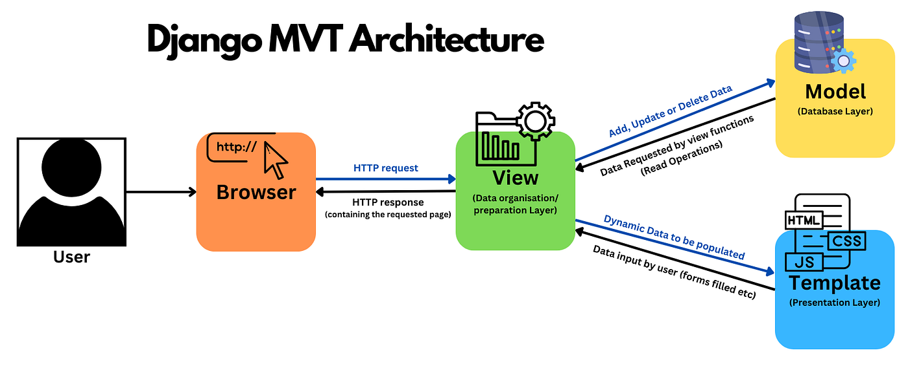

Tugas Individu 2 PBP: Football Shop - NOPALZ SPORTY

## Link Aplikasi
Aplikasi PWS saya dapat diakses pada tautan berikut:
(https://muhammad-naufal419-footballshop.pbp.cs.ui.ac.id/)

## Implementasi Checklist (Step by Step)
Referensi utama saya dalam mengimplementasikannya adalah berdasarkan tutorial 0 dan 1. Selain itu, saya juga sudah mempelajari dengan baik dari materi PBP pada pertemuan-pertemuan sebelumnya dan playlist YouTube Kelas Terbuka dengan judul "Tutorial Django 1.11 LTS Bahasa Indonesia".
Berikut urutan implementasi secara berurut yang saya lakukan,
1. **Membuat proyek Django baru dan melakukan setup awal**
    Saya membuat proyek Django baru terlebih dahulu. Selanjutnya, saya melakukan setup awal proyek, seperti github, 'settings.py', 'urls.py', dan 'manage.py'.
2. **Membuat Aplikasi Django**
    Saya membuat aplikasi dengan menambahkan 'main' dan dilakukan _routing_ pada aplikasi tersebut dan setup awal lainnya.
3. **Membuat Model**
    Saya membuat model 'Product' pada 'models.py' dengan _field_ yang sudah ditentukan pada deskripsi tugas ditambah dengan beberapa field hasil kreasi saya. Setelah membuat model tersebut, saya melakukan migrasi model agar menyesuaikan perubahan pada skema basis data dengan definisi model yang sudah ada.
4. **Membuat View**
    Saya membuat fungsi pada 'views.py' dan Template untuk menampilkan halaman utama.
5. **Menghubungkan URL**
    Saya menambahkan path di 'urls.py' agar request diarahkan ke view yang sesuai.
6. **Deployment ke PWS**
    Saya menambahkan proyek baru di PWS, lalu menambahkan domain PWS ke file 'settings.py'. Terakhir, commit perubahkan ke _repository_ GitHub dan _push_ ke remote PWS.

## Alur MVT

Source: (https://pbp-fasilkom-ui.github.io/ganjil-2025/docs/tutorial-1)
[Client] -> (Request) [urls.py] -> (Routing) -> [views.py] -> (Ambil/olah data) [models.py] -> (Kembalikan data & Render context) [template HTML] -> (HTTP Response) [Client]
**Penjelasan**:
Ketika seorang client mengakses aplikasi melalui browser, sebuah HTTP request dikirimkan ke server Django. Request tersebut akan diteruskan ke 'urls.py' ke view yang sesuai. Selanjutnya, view pada views.py akan mengatur logika aplikasi, termasuk memanggil models.py jika perlu mengambil, menambah, mengubah, atau menghapus data di database. Data yang diperoleh dari model kemudian dikirim kembali ke view, yang selanjutnya menyiapkan context untuk diberikan ke template HTML. Template ini akan merender data menjadi halaman web yang rapi dan dapat dibaca. Akhirnya, hasil render berupa HTML response dikirimkan kembali ke browser client untuk ditampilkan kepada pengguna.

## Peran 'settings.py'
Peran 'settings.py' pada proyek Django adalah sebagai pusat konfigurasi. 'settings.py' mengonfigurasikan daftar aplikasi (INSTALLED_APPS), basis data (DATABASE), daftar domain yang diizinkan (ALLOWED_HOSTS), dan lokasi file statis (STATIC_URL & MEDIA_URL).

## Cara Kerja Migrasi Database di Django
Cara kerja migrasi database di Django antara lain,
1. Ketika model sudah dibuat atau diubah, kita akan menjalankan, 'python manage.py makemigrations'. Dari kode tersebut, Django akan membuat file migrasi.
2. Selanjutnya, kita akan menjalankan kode 'python manage.py migrate'. Django akan menerjemahkan instruksi ke SQL dan menjalankannya ke database.
3. Hasilnya adalah struktur database sesuai dengan model yang sudah didefinisikan.

## Alasan Django dipilih sebagai Permulaan untuk Pemula
Menurut saya, berikut beberapa alasan Django dijadikan permulaan untuk pembelajaran Software Development:
1. Django adalah kerangka dari bahasa pemrograman Python, ini adalah bahasa pemrograman yang umum dipelajari untuk orang-orang yang baru masuk ke dalam dunia pemrograman, sehingga belajar Django dapat lebih mudah. 
2. Banyak fitur bawaan yang dimiliki oleh Django, seperti ORM, template engine, dan lain-lain.
3. Konsep MVT yang memudahkan pemisahan antara data, logika, dan tampilan.

## Feedback untuk Asisten Dosen
Berikut feedback saya untuk asisten dosen tutorial 1,
- Dokumentasi tutorial 1 sudah sesuai dan sistematis sehingga memudahkan saya belajar. Namun, masih ada beberapa poin yang tidak dijelaskan atau hanya penjelasan singkat sehingga saya kurang memahami apa yang sedang dikerjakan.
- Saya berharap di tutorial banyak menambahkan beberapa ilustrasi untuk memudahkan saya terhadap alur-alur dari mata kuliah PBP ini.