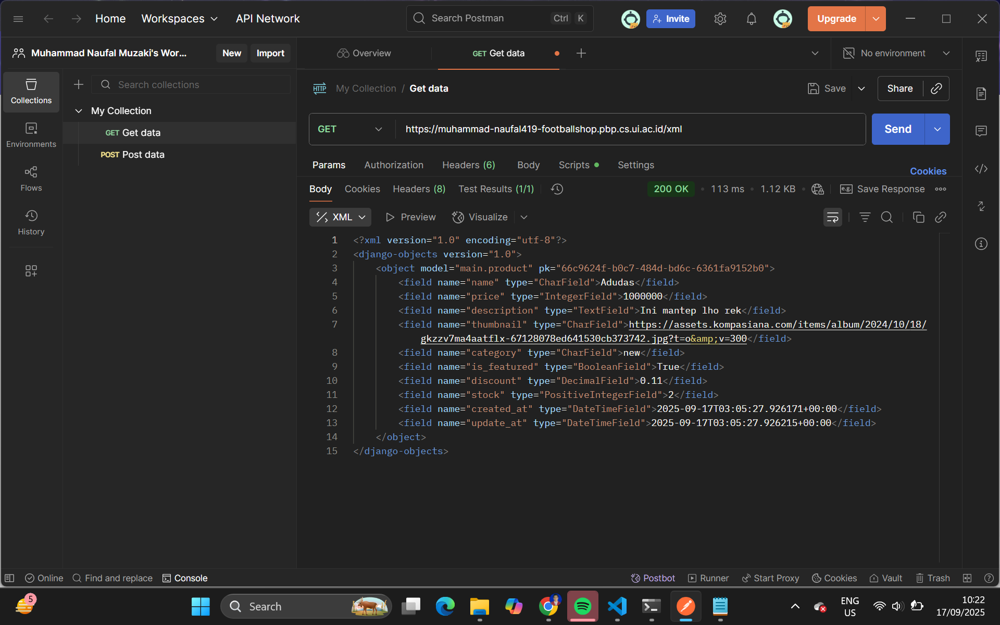

# Tugas Individu 2 PBP: Implementasi _Model-View-Template_ (MVT) pada Django

## Link Aplikasi
Aplikasi PWS saya dapat diakses pada tautan berikut:
(https://muhammad-naufal419-footballshop.pbp.cs.ui.ac.id/)

## Implementasi Checklist Tugas 2 (Step by Step)
Referensi utama saya dalam mengimplementasikannya adalah berdasarkan tutorial 0 dan 1. Selain itu, saya juga sudah mempelajari dengan baik dari materi PBP pada pertemuan-pertemuan sebelumnya dan playlist YouTube Kelas Terbuka dengan judul "Tutorial Django 1.11 LTS Bahasa Indonesia".
Berikut urutan implementasi secara berurut yang saya lakukan,
1. **Membuat proyek Django baru dan melakukan setup awal**
    Saya membuat proyek Django baru terlebih dahulu. Selanjutnya, saya melakukan setup awal proyek, seperti github, `settings.py`, `urls.py`, dan `manage.py`.
2. **Membuat Aplikasi Django**
    Saya membuat aplikasi dengan menambahkan `main` dan dilakukan _routing_ pada aplikasi tersebut dan setup awal lainnya.
3. **Membuat Model**
    Saya membuat model `Product` pada `models.py` dengan _field_ yang sudah ditentukan pada deskripsi tugas ditambah dengan beberapa field hasil kreasi saya. Setelah membuat model tersebut, saya melakukan migrasi model agar menyesuaikan perubahan pada skema basis data dengan definisi model yang sudah ada.
4. **Membuat View**
    Saya membuat fungsi pada `views.py` dan Template untuk menampilkan halaman utama.
5. **Menghubungkan URL**
    Saya menambahkan path di `urls.py` agar request diarahkan ke view yang sesuai.
6. **Deployment ke PWS**
    Saya menambahkan proyek baru di PWS, lalu menambahkan domain PWS ke file `settings.py`. Terakhir, commit perubahkan ke _repository_ GitHub dan _push_ ke remote PWS.

## Alur MVT

Source: (https://pbp-fasilkom-ui.github.io/ganjil-2025/docs/tutorial-1)
[Client] -> (Request) [urls.py] -> (Routing) -> [views.py] -> (Ambil/olah data) [models.py] -> (Kembalikan data & Render context) [template HTML] -> (HTTP Response) [Client]
**Penjelasan**:
Ketika seorang client mengakses aplikasi melalui browser, sebuah HTTP request dikirimkan ke server Django. Request tersebut akan diteruskan ke `urls.py` ke view yang sesuai. Selanjutnya, view pada views.py akan mengatur logika aplikasi, termasuk memanggil models.py jika perlu mengambil, menambah, mengubah, atau menghapus data di database. Data yang diperoleh dari model kemudian dikirim kembali ke view, yang selanjutnya menyiapkan context untuk diberikan ke template HTML. Template ini akan merender data menjadi halaman web yang rapi dan dapat dibaca. Akhirnya, hasil render berupa HTML response dikirimkan kembali ke browser client untuk ditampilkan kepada pengguna.

## Peran `settings.py`
Peran `settings.py` pada proyek Django adalah sebagai pusat konfigurasi. `settings.py` mengonfigurasikan daftar aplikasi (INSTALLED_APPS), basis data (DATABASE), daftar domain yang diizinkan (ALLOWED_HOSTS), dan lokasi file statis (STATIC_URL & MEDIA_URL).

## Cara Kerja Migrasi Database di Django
Cara kerja migrasi database di Django antara lain,
1. Ketika model sudah dibuat atau diubah, kita akan menjalankan, `python manage.py makemigrations`. Dari kode tersebut, Django akan membuat file migrasi.
2. Selanjutnya, kita akan menjalankan kode `python manage.py migrate`. Django akan menerjemahkan instruksi ke SQL dan menjalankannya ke database.
3. Hasilnya adalah struktur database sesuai dengan model yang sudah didefinisikan.

## Alasan Django dipilih sebagai Permulaan untuk Pemula
Menurut saya, berikut beberapa alasan Django dijadikan permulaan untuk pembelajaran Software Development:
1. Django adalah kerangka dari bahasa pemrograman Python, ini adalah bahasa pemrograman yang umum dipelajari untuk orang-orang yang baru masuk ke dalam dunia pemrograman, sehingga belajar Django dapat lebih mudah. 
2. Banyak fitur bawaan yang dimiliki oleh Django, seperti ORM, template engine, dan lain-lain.
3. Konsep MVT yang memudahkan pemisahan antara data, logika, dan tampilan.

## Feedback untuk Asisten Dosen
Berikut feedback saya untuk asisten dosen tutorial 1,
- Dokumentasi tutorial 1 sudah sesuai dan sistematis sehingga memudahkan saya belajar. Namun, masih ada beberapa poin yang tidak dijelaskan atau hanya penjelasan singkat sehingga saya kurang memahami apa yang sedang dikerjakan.
- Saya berharap di tutorial banyak menambahkan beberapa ilustrasi untuk memudahkan saya terhadap alur-alur dari mata kuliah PBP ini.

# Tugas Individu 3 PBP: Implementasi Form dan Data Delivery pada Django

## Pentingnya Data Delivery pada Pengembangan suatu Platform
Data Delivery adlaah proses penting dalam sebuah platform karena memastikan data yang sudah dikumpulkan, diolah, dan disimpan dapat sampai ke pengguna akhir secara tepat waktu, aman, dan konsisten. Dalam pengembangan suatu platform, ada suatu saat kita perlu mengirimkan atau memanfaatkan suatu data. Tandpa adanya mekanisme pengiriman, data, informasi hanya akan berhenti di di server atau database dan tidak pernah bisa dimanfaatkan oleh pengguna. Dengan data delivery, platform mampu menyajikan informasi yang selalu up-to-date sehingga pengguna tidak mengalami ketidaksesuaian, misalnya melihat stok tersedia padahal sudah habis.

## Antara XML dan JSON? Mengapa JSON leih populer?
Menurut saya, saya lebih sering menggunakan JSON dibandingkat XML karena mudah dibaca datanya dan formatnya hampir serupa dengan _dictionary_ di python. Penggunaan JSON umumnya lebih populer dan disukai karena lebih ringkas dan mudah dipahami dengan format _key-value_, performa biasanya berlangsung lebih cepat (ukuran berkas yang lebih kecil dan transmisi data yang lebih cepat), dan kompatibel dengan kerangka kerja JavaScript.

## Apa itu dan pentingnya method `is_valid()`?
Method `is_valid()` adalah method yang dipanggil untuk memvalidasi data form setelah form di-_binding_ dengan data. Saat kita memanggil method tersebut, ia akan mengecek apakah semua fields wajib sudah diisi, apakah semua tipe data valid, apakah panjang data valid, dan apakah validasi tambahan sudah valid juga. Jika semua validasi lolos, maka `is_valid` akan mengembalikan `True`. Ini penting karena untuk mengamankan data dan mencegah input yang tidak sesuai, menjamin kondistensi database, dan memberi feedback ke user.

## Penggunaan `csrf_token` saat membuat form di Django
Serangan Cross Site Request Forgery (CSRF) terjadi ketika situs web berbahaya mengandung tautan, tombol formulir, atau kode JavaScript yang dimaksudkan untuk melakukan tindakan tertentu di situs web kita, menggunakan kredensial pengguna yang sedang login dan mengunjungi situs berbahaya tersebut melalui browser mereka. `csrf_token` adalah token keamanan yang Django sisipkan di setiap form **POST**. Cara kerjanya adalah Django akan menempelkan token unik ke form, lalu ketika form disubmit, token ikut terkirim, server akan memverivifikasi token tersebut, kalau token tidak cocok, request ditolak. Kalau CSRF protection dimatikan, User bisa dimanupulasi untuk mengirimkan request tanpa sadar. Cara penyerang memanfaatkannya adalah sebagai berikut,
- Misal saya sedang login ke web saya
- Penyerang membuat suatu web yang berisi request `jahat` ke web saya
- Saya mungkin tanpa sadar membuka web penyerang sehingga otomatis mengirim cookie sesi yang valid ke web saya
- Web saya melihat request dan cookie yang valid, lalu penyerang bisa memanipulasi web saya, seperti menghapus data, mengubah password, dan lain-lain.

## Implementasi Checklist Tugas 3 (Step by Step)
Berikut cara saya menyelesaikan tugas 3 dengan mengimplementasikan checklist yang diberikan,
- Pertama-tama, saya membaca terlebih dahulu apa yang akan dilakukan di tugas ini.
- Setelah saya mengetahui apa yang harus dilakukan, saya mulai mengerjakan dengan sebagain besar mengambil referensi dari Tutorial 2.
- Menambahkan 4 fungsi XML, JSON, XML by ID, JSON by ID, di fungsi `main/views.py`
- Menambahkan routing URL untuk setiap view
- Membuat halaman list data + tombol “Add” dan “Detail”
- Membuat halaman form untuk menambahkan objek, membuat `ProductForm` yang berisi field input yang relevan, menambah view `create_products`, dan membuat template `crate_products.html`.
- Membuat halaman detail data, dengan menambahkan `show_product` dan template `products_detail.html`.
- Menjawab pertanyaan di README dan menambahkan _screenshot_ dari hasil akses URL pada Postman ke README. 
- 
*Tiap poin checklist, saya mencari apa _dependency_ yang dibutuhkan untuk membuat suatu program. Jika saya bingung terhadap suatu hal, saya akan menanyakan program tersebut dengan _tools_ yang ada.

## Feedback untuk Asisten Dosen
Tutorial dan tugas sudah sangat jelas dan pastinya membantu saya untuk memahami cara kerja Django dan beberapa komponen lainnya.

## Akses URL menggunakan Postman

# Referensi
- [Perbandingan antara XML dan JSON – UltaHost Blog](https://ultahost.com/blog/id/perbandingan-antara-xml-dan-json-mana-yang-lebih-baik/)  
- [Django Form API Documentation](https://docs.djangoproject.com/en/5.2/ref/forms/api/)  
- [Django CSRF Documentation](https://docs.djangoproject.com/en/5.2/ref/csrf/)